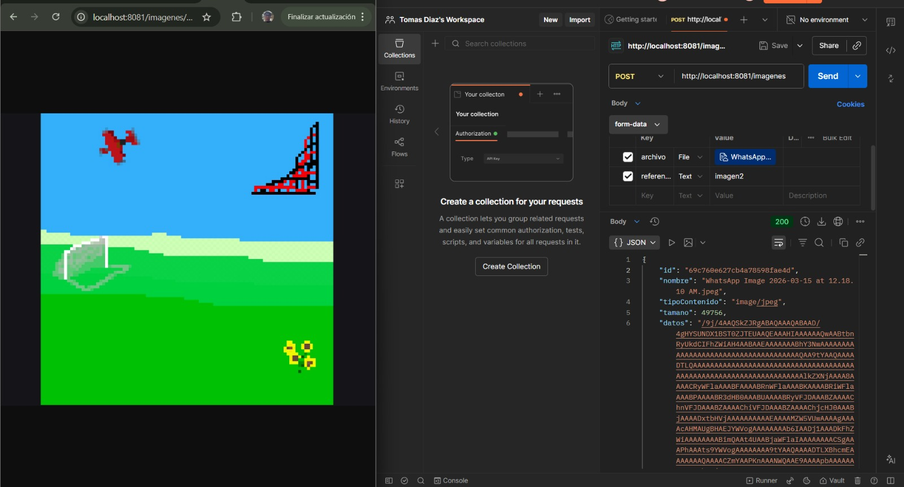
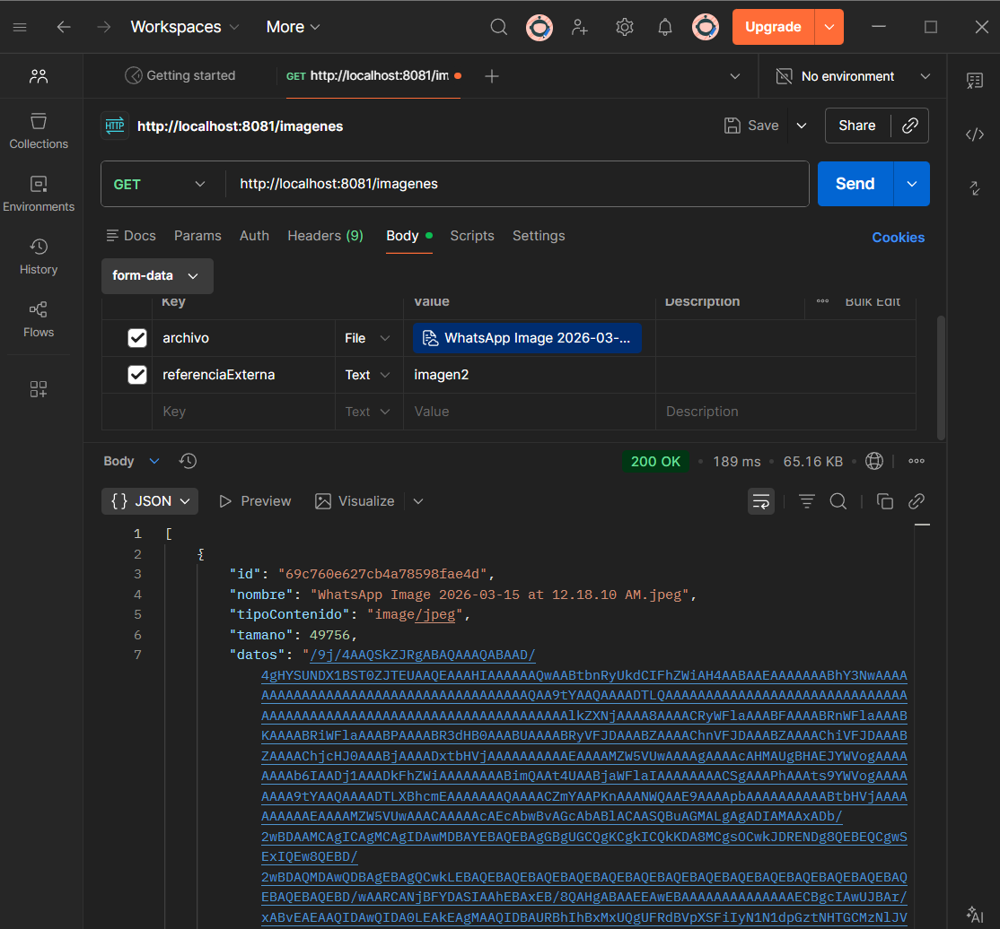
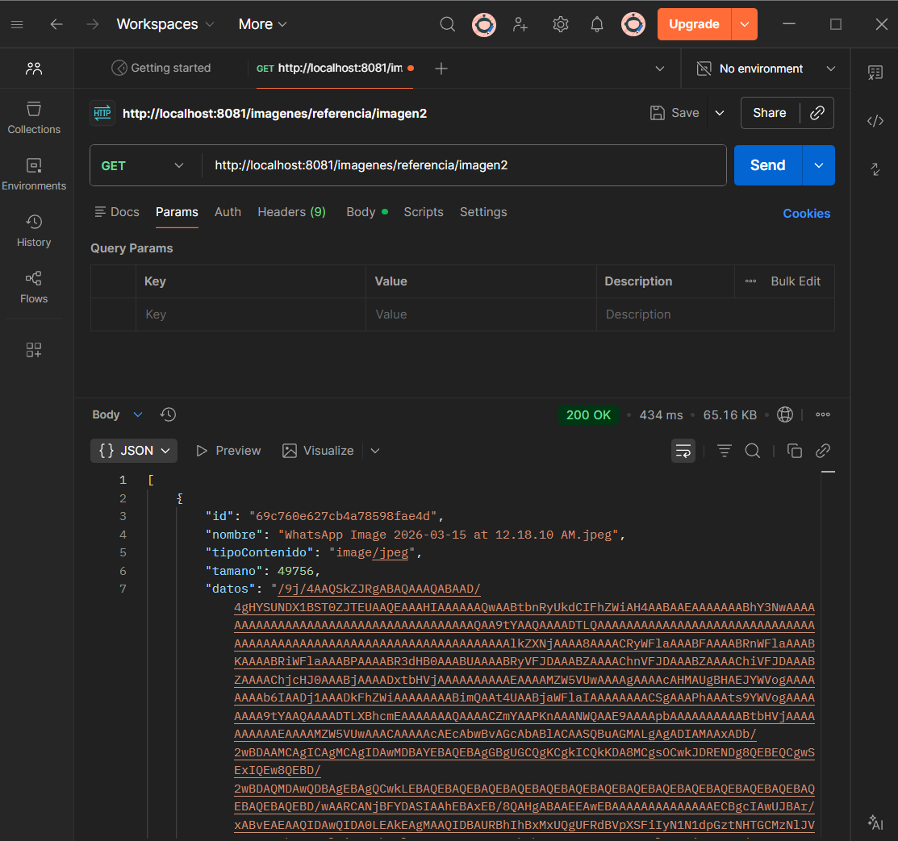
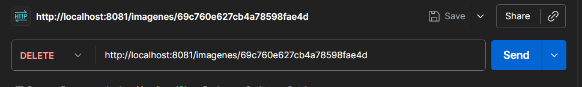
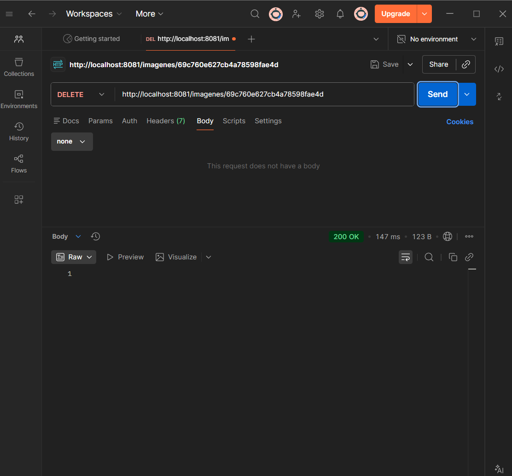
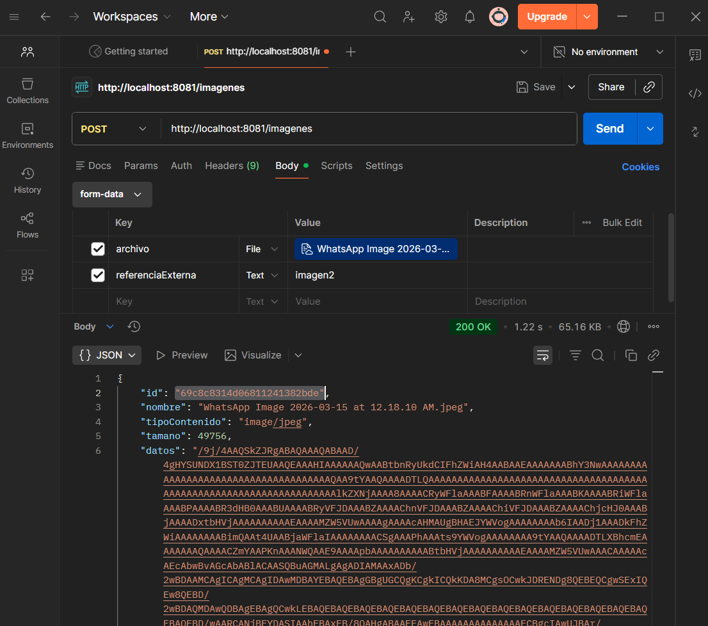
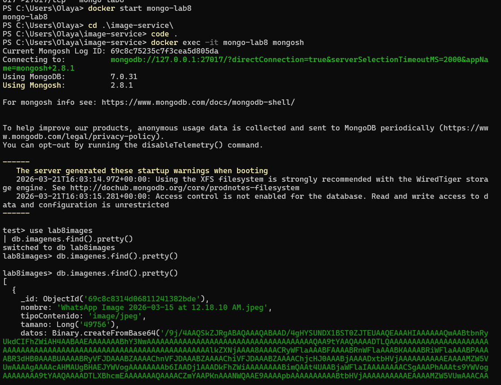

# image-service

Image microservice built with Spring Boot and MongoDB, developed as part of Laboratory 8 – DATA.

Its purpose is to manage the storage of project images (tournaments, players, etc.) independently from the main project.

## Technologies

- Java 17
- Spring Boot
- Spring Data MongoDB
- Maven
- MongoDB (Docker)
- Postman (testing)

## Prerequisites

- Java 17 installed
- Maven installed
- Docker installed

## Start MongoDB with Docker
```bash
docker run --name mongo-lab8 -p 27017:27017 -d mongo
```

## Configuration

File `src/main/resources/application.properties`:
```properties
spring.data.mongodb.uri=mongodb://localhost:27017/lab8images
server.port=8081
```

## Run the project
```bash
mvn spring-boot:run
```

## Tests performed with Postman

### 1. Upload an image

- Method: `POST`
- URL: `http://localhost:8081/imagenes`
- Body: `form-data`
- Key: `archivo` | Type: `File` | Value: (image we select)
- Key: `referenciaExterna` | Type: `Text` | Value: `imagen2`

#### 1.2. List images by external reference

- Method: `GET`
- URL: `http://localhost:8081/imagenes/referencia/torneo-1`

**Evidence:**



### 2. List images

- Method: `GET`
- URL: `http://localhost:8081/imagenes`

**Evidence:**




### 3. Get image by ID

- Method: `GET`
- URL: `http://localhost:8081/imagenes/{id}`
- Replace `{id}` with the id returned when uploading the image.

**Evidence:**



### 5. Delete an image

- Method: `DELETE`
- URL: `http://localhost:8081/imagenes/{id}`
- Replace `{id}` with the id of the image to delete.

**Evidence:**




---
## MongoDB storage evidence

### Step by step: from Postman to terminal verification

#### 1. Upload image from Postman

- Open Postman and create a new request.
- Method: `POST`
- URL: `http://localhost:8081/imagenes`
- Go to the **Body** tab → select **form-data**
- Add the following fields:

| Key               | Type | Value                        |
|-------------------|------|------------------------------|
| `archivo`         | File | image from the main repo     |
| `referenciaExterna` | Text | `imagen2`                  |

- Once we click **Send**, MongoDB will return the id which gave us: 69c8c8314d06811241382bde.



#### 2. Start the MongoDB container

If the container is not running, start it with:
```bash
docker start mongo-lab8
```

#### 3. Enter mongosh inside the container
```bash
docker exec -it mongo-lab8 mongosh
```

#### 4. Select the database
```js
use lab8images
```

#### 5. Query the stored documents
```js
db.imagenes.find().pretty()
```

**MongoDB storage evidence:**


